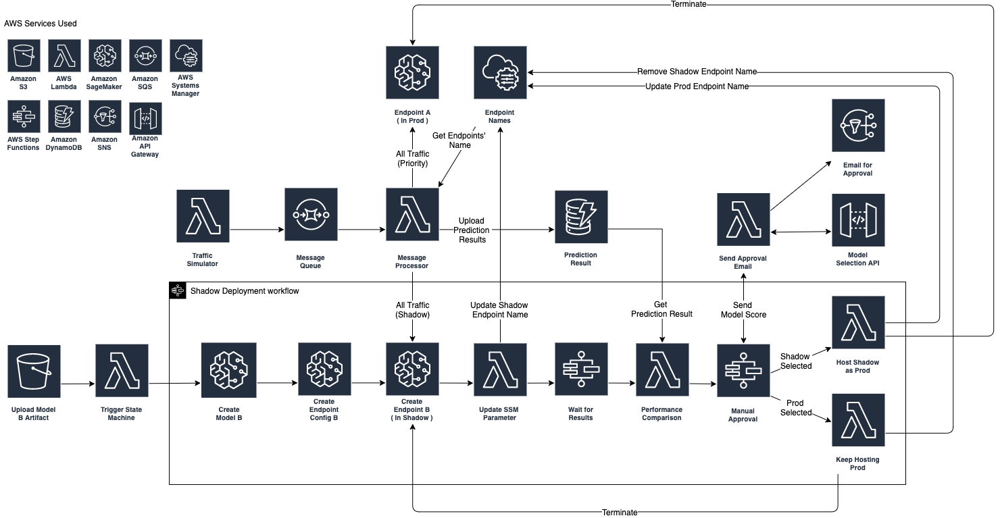
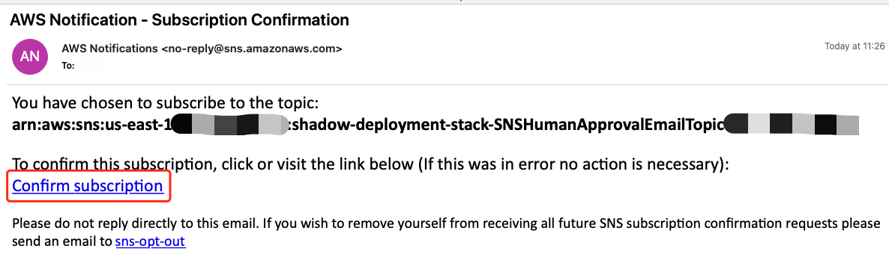

# ML Model Shadow Deployment Strategy on AWS

This repository contains example template that show how to deploy your newly trained model in production environment as shadow and received the same traffic as the existing prod model without influencing production. 

This template is code in AWS Serverless Application Model framework. If you want to know more, please check [Doc](https://docs.aws.amazon.com/serverless-application-model/latest/developerguide/what-is-sam.html)

## Solution Architecture


### What is Shadow Deployment [Reference](https://thenewstack.io/deployment-strategies/#:~:text=A%20shadow%20deployment%20consists%20of,load%20on%20a%20new%20feature.)

A shadow deployment consists of releasing version B alongside version A, fork version A’s incoming requests and send them to version B as well without impacting production traffic. This is particularly useful to test production load on a new feature. A rollout of the application is triggered when stability and performance meet the requirements.

This technique is fairly complex to setup and needs special requirements, especially with egress traffic. For example, given a shopping cart platform, if you want to shadow test the payment service you can end-up having customers paying twice for their order. In this case, you can solve it by creating a mocking service that replicates the response from the provider.


Pros:

- Performance testing of the application with production traffic.
- No impact on the user.
- No rollout until the stability and performance of the application meet the requirements.

Cons:

- Expensive as it requires double the resources.
- Not a true user test and can be misleading.
- Complex to setup.
- Requires mocking service for certain cases.

## Usage Guide

### Setup

Execute the command in code repo root directory (```cd aws-shadow-deployment``` after git clone this repo to local)

- Update update ```Email Defualt value``` in [template.yaml](template.yaml) used to receive manual approval request and you should receive a SNS Topic Subscription Email after you Deploy SAM Template



- Make sure you've install AWS CLI in local. If not, follow [Doc](https://docs.aws.amazon.com/cli/latest/userguide/cli-chap-install.html)

- ```chmod +x setup.sh```

- ```./setup.sh ```

### Trigger Shadow Deployment Workflow

- Visit CloudFormation console and wait all three stacks with 'shadow-deployment' as prefix completed

- Check the Outputs of stack 'shadow-deployment-stack' and find the bucket name in Key ```ModelBucketName``` with 'shadow-deployment-model-registry-bucket'


- Visit S3 console

- Upload another [model.tar.gz](inital_materials/shadow_model/model.tar.gz) to the S3 bucket above


### Manual Approval

- After a certain time window for prediction result colleciton, two model's performances will be send to your email address you specified above. You should receive one email like this


- Click the link next to ```Shadow Model``` if you want to promote shadow model into fully production. If you want to keep use the current production model, click the link next to ```Production Modle```


## License

This library is licensed under the MIT-0 License. See the LICENSE file.

